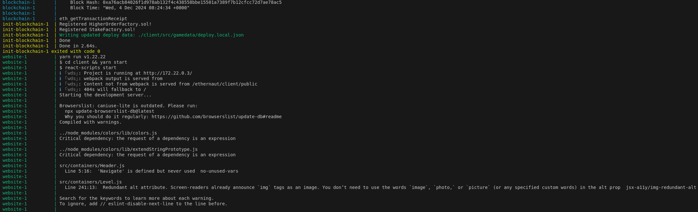

# Ethernaut

Ethernaut is a Web3/Solidity based wargame inspired by [overthewire](https://overthewire.org), to be played in the Ethereum Virtual Machine. Each level is a smart contract that needs to be 'hacked'.

The game acts both as a tool for those interested in learning ethereum, and as a way to catalogue historical hacks as levels. There can be an infinite number of levels and the game does not require to be played in any particular order.

## Hosting the game locally

The CTF is composed of 3 components:

- Test Network - A blockchain running locally.
- Contract Deployment - A script deploying the smart contracts.
- The Client/Frontend - A React app that runs locally and can be accessed on [localhost:3000](localhost:3000).

In order to install, build, and run Ethernaut locally, follow these instructions:

First clone this repository and its submodules with

#### Linux/MacOS

```bash
git clone --recurse-submodules https://gitlab.uliege.be/blockchains/ethereum/ctf-games/ethernaut/ethernaut.git
```


#### Windows

```bash
git clone -b vj-docker-compose-support-for-windows --recurse-submodules https://gitlab.uliege.be/blockchains/ethereum/ctf-games/ethernaut/ethernaut.git
```

### Option 1: With Docker Compose
To host the Ethernaut game locally (i.e. the local blockchain and the website), please run:
```
docker compose up
```

Building up the Docker image for the first time can take up to 5 minutes.
Shortly after the image is built, three containers should start running.




### Option 2: From source
In case the previous option didn't work, you can refer to this section to host the game on your machine.

0. Be sure to use a compatible Node version. If you use `nvm` you can run `nvm use` at the root level to be sure to select a compatible version.

1. Install dependencies:

    ```bash
    yarn install
    ```

2. Start deterministic rpc

    ```bash
    yarn network
    ```

3. Compile contracts

    ```bash
    yarn compile:contracts
    ```

4. Deploy contracts

    ```bash
    yarn deploy:contracts
    ```

5. Start Ethernaut locally

    ```bash
    yarn start:ethernaut
    ```

------
------

## Play

The game is hosted at [http://localhost:3000/](http://localhost:3000/).

### Setup MetaMask

If you don't have it already, install the [MetaMask browser extension](https://metamask.io/) (in Chrome, Firefox, Brave or Opera on your desktop machine).

Set up the extension's wallet and use the network selector to add a custom network.

Configure the network as follows:
1. Set the RPC URL to `http://localhost:8545`.
2. Set the Chain ID to `31337`.
3. Set the Currency symbol to `GO`.


Once done, make sure to select this network, come back here and reload the webpage.

Now the webapp is configured to use the local blockchain which is running on your device.

This local blockchain is configured with multiple wallets containing sufficient ETH to run the lab.

Follow the steps of described [here](https://support.metamask.io/fr/managing-my-wallet/accounts-and-addresses/how-to-import-an-account/#:~:text=From%20the%20wallet%20view%2C%20tap,supported%20by%20the%20other%20wallet.) to import the private key `ac0974bec39a17e36ba4a6b4d238ff944bacb478cbed5efcae784d7bf4f2ff80`.

**Note**: this private key is a well-known private key used for testing. **Do not use it on a real network**.

### Game Mechanics

The game uses the main contract `Ethernaut.sol` to manage player progress and delegate interaction with `Level.sol` implementations. Each level contract emits instances for players to manipulate, break, destroy, fix, etc. The player requests an instance, manipulates it and returns it to the game for evaluation of level completion.

Both requesting instances and submitting instances back to the game are done with the buttons in the user interface in each level. When this app retrieves an instance from `Ethernaut.sol`, it wraps it in a `TruffleContract` object and exposes it in the browser's console. See the first level for a full tutorial on how to play the game.

### Using the console

Most game interaction is via the browser's console: `Dev Tools -> Console`. Open the console and enter the command:

`help()`

 to see a list of objects and functions injected by the game to the console. Since most interactions are asynchronous, we recommend using Chrome v62 which enables the `async/await` keywords in the console, so instead of writting:

`getBalance(player)> PROMISE`

 and opening the promise. With await/async, you can write:

`await getBalance(player) > '1.11002387' `

### Beyond the console

Some levels will require working outside of the browser console. That is, writing solidity code and deploying it in the network to attack the level's instance contract with another contract. This can be done in multiple ways, but we recommend using Remix to write the code and deploy it in the corresponding network See [Remix Solidity IDE](https://remix.ethereum.org/).

### Cheat Sheet

A bunch of commands to help the folks which are unfamiliar with JavaScript.

| Command                              | Details |
|----------------------------------------------------------------------------|------------------------------------------------------------------------------------|
|  (await contract.someProperty()).toNumber() | Fetches the property "someProperty" (int) stored within a contract. Then, it converts to a number as it's initial type is a BigNumber (i.e. an object). |
| await contract.f({value: toWei("0.0001")})                                 | Call the function 'f' of the contract and send 0.0001 ether along the transaction. |
| await sendTransaction({from: player, to: contract.address, value: toWei("0.1"), gas: 100000}) | Send a transaction from the player address to the contract with 0.1 ether and a gas limit of 100000.         |
| web3.eth.abi.encodeFunctionSignature("someFunction")| Compute the function selector of 'someFunction'         |

### Useful resources

[Solidity documentation](https://docs.soliditylang.org/en/v0.8.0/): adapt the version to the one of the smart contract.

## Troubleshooting
### Issue: Contracts Deployment Failing

A participant noticed that their deployment was stuck because the smart contracts failed to deploy correctly. Below is the error reported to us:

```bash
init-blockchain-1  | Error: Returned error: replacement transaction underpriced -- Reason given: Custom error (could not decode).
```

This transient error likely occurred due to the concurrent deployment of the contracts.

**Solution**:

- Stop the command `docker compose` and restart it.

### Issue: Transactions Failing After Lab Restart
Your local blockchain’s state is not permanently saved to disk. This means that each time you restart the lab (specifically, the Docker container running the blockchain), the blockchain is reset.

However, MetaMask keeps a record of your previous activity on the local blockchain, and it does not automatically clear this history. This causes MetaMask to be out-of-sync with the blockchain, which prevents you from publishing new transactions.

**Solution**:

- Clear the activity tab data:
    - Open the MetaMask extension.
    - Click on the three dots in the upper right corner.
    - Go to "Settings," then select "Advanced Settings."
    - Click on "Clear activity tab data."
- Disconnect MetaMask from localhost:3000 and reconnect:
    - Open the MetaMask extension.
    - Click on the circle icon next to the three dots.
    - Click on "Disconnect" and then reconnect.